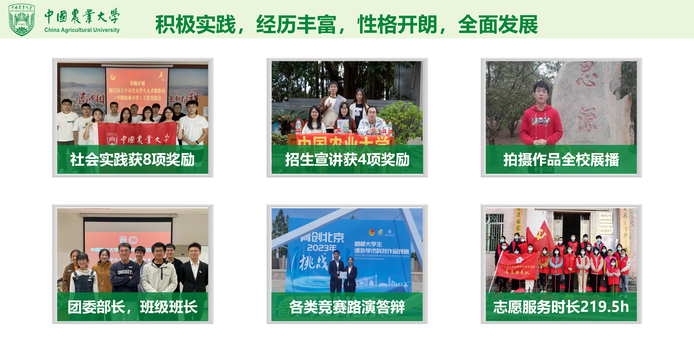

# 👥竞赛实践经历

在大学期间，参与多类学科竞赛和社会实践，获得省部级奖项**4**项，校级奖项**12**项，其中担任负责人的项目**13**项，具体获奖项目如表格所示。

| **项目**                               | **等级**          |
| :------------------------------------- | :---------------- |
| 2023年挑战杯大学生课外学术科技作品竞赛 | 北京市二等奖      |
| 2022年全国大学生数学建模竞赛           | 北京市二等奖/队长 |
| 2023年蓝桥杯程序设计大赛Python A组     | 北京市三等奖      |
| 2023年“青梅见研”暑期社会实践调研       | 市级优秀成果/队长 |
| 2023年“强农杯”中国农业大学创新创业大赛 | 校级特等奖        |
| 2023年全国大学生数学建模选拔赛         | 校级一等奖/队长   |
| 2023年全国大学生数学建模选拔赛         | 校级一等奖/队长   |
| 2021年中国农业大学思政课微视频大赛     | 校级一等奖/队长   |
| 2021年中国农业大学大数据竞赛           | 校级二等奖        |
| 2022年全国大学生物理实验竞赛校内选拔赛 | 校级二等奖/队长   |
| 2022年中国农业大学物理实验竞赛         | 校级三等奖/队长   |
| 2021年“薪火相传”回访高中母校实践活动   | 优秀团队/队长     |
| 2022年暑期社会实践                     | 优秀团队/队长     |
| 2023年暑期社会实践                     | 优秀团队/队长     |
| 2022年暑期社会实践                     | 优秀成果/队长     |
| 2023年暑期社会实践                     | 优秀成果/队长     |

🏓兴趣爱好
===
* 各类运动：乒乓球，篮球，跑步等
* 悬疑电影和悬疑剧
* 拍照摄影

🌏未来规划
===

经过本科课程的学习，我对数据科学和统计学各领域有了较为全面的认识，希望在完成本科学习任务后，能继续攻读硕士或博士学位，未来能够继续从事数据科学、统计学方面的研究。我计划系统学习数据科学和统计学领域的最新发展和技术，不断拓宽自己的专业视野，培养综合科研素质。我希望有机会能够赴海外学习和交流，通过国际视野来促进个人和专业上的成长。

